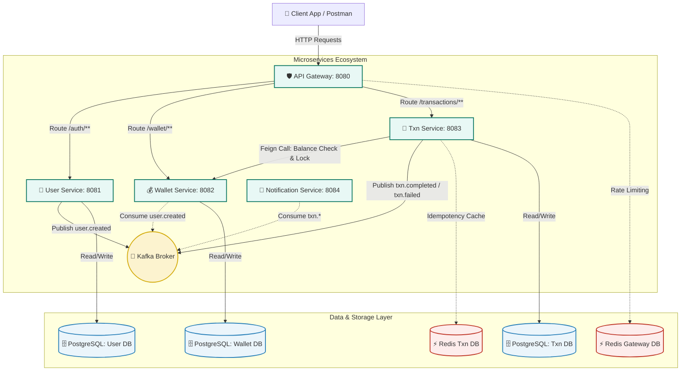

# 💳 Mini-UPI Project Context & Sync Sheet
> **System Status**: Under Active Development (Phase 1)
> **1-Line Pitch**: *Production-grade UPI simulator: 5K TPS, zero double-spends, event-driven microservices.*

This document provides a comprehensive technical context of the **Mini-UPI Simulator** project. Share this directly with any AI agent to establish instant context alignment, architectural synchronization, and coding style consistency.

---

## 🏗️ 1. High-Level Architecture & Ecosystem

The project is structured as a **Maven Multi-Module** microservices application utilizing **Java 21** and **Spring Boot 3.3.x**. 



---

## 📡 2. Core Service Directory & Infrastructure Map

| Module Name | Port | Primary DB | Cache / Key-Value | Kafka Event Role | Responsibilities & Focus |
| :--- | :---: | :---: | :---: | :---: | :--- |
| [**api-gateway**](file:///d:/Neeraj%20Surnis/Prsnl_Project/UPI/upi/api-gateway) | `8080` | None | Redis (Rate Limiter) | None | Reactive edge gateway, route mapping, token bucket rate limiter, JWT extraction & edge validation. |
| [**user-service**](file:///d:/Neeraj%20Surnis/Prsnl_Project/UPI/upi/user-service) | `8081` | PostgreSQL | None | Producer: `user.created` | Handles identity registry, BCrypt password hashing, UPI ID generation, JWT issue (JJWT), and outbox logging. |
| [**wallet-service**](file:///d:/Neeraj%20Surnis/Prsnl_Project/UPI/upi/wallet-service) | `8082` | PostgreSQL | None | Consumer: `user.created` | Core ledger system. Wallet creation, double-entry ledgers (Debits/Credits), `@Transactional` balance updates with **Optimistic Locking**. |
| [**transaction-service**](file:///d:/Neeraj%20Surnis/Prsnl_Project/UPI/upi/transaction-service) | `8083` | PostgreSQL | Redis (Idempotency) | Producer: `txn.completed`, `txn.failed` | The orchestration brain. Idempotency checks, daily limit fraud controls, Feign calls, payment status state tracking (Saga pattern). |
| [**notification-service**](file:///d:/Neeraj%20Surnis/Prsnl_Project/UPI/upi/notification-service) | `8084` | None | None | Consumer: `txn.completed`, `txn.failed` | Asynchronous alerts, simulated SMS/Email notifications of transactions. |
| [**common**](file:///d:/Neeraj%20Surnis/Prsnl_Project/UPI/upi/common) | N/A | Shared Library | None | None | Shared classes: Custom exceptions (`BaseException`), global API structures (`ApiResponse`), payload objects. |

---

## 🛡️ 3. Key Technical & Safety Patterns

To ensure **high throughput (5,000+ TPS)** and **zero double-spends / duplicate transactions**, the architecture integrates several rigorous distributed systems patterns:

### 1. Concurrency Safety: Optimistic Locking (`@Version`)
*   **Problem**: High frequency concurrent transfers accessing the same wallet database row. Pessimistic locks lock rows and trigger DB deadlocks/low throughput.
*   **Solution**: The `Wallet` entity includes a `@Version` attribute. If two parallel requests try to write to the same wallet balance, the first successful commit increments the version; the second execution fails gracefully with an `OptimisticLockingFailureException`. The application catches this to trigger a brief backoff-and-retry or client alert, completely avoiding double debits.

### 2. Request Safety: Redis-backed Idempotency
*   **Problem**: Distributed network dropouts cause mobile clients to retry transaction requests. Simply running the logic again can lead to "double debits".
*   **Solution**: Every payment transaction request requires a unique `Idempotency-Key` (in the HTTP headers). The `transaction-service` uses Redis to cache the `Idempotency-Key` for 24 hours.
    1. Check Redis for `idempotency:{key}`.
    2. If it exists, return the cached successful response immediately without making any DB or wallet calls.
    3. If new, acquire a temporary lock, execute the flow, record the result, and cash it with a 24h TTL.

### 3. Reliability: Transactional Outbox Pattern
*   **Problem**: Publishing an event directly to Kafka inside a Spring `@Transactional` service can fail (due to broker network outage), leaving the database committed but the event lost (Dual-Write Problem).
*   **Solution**: Inside `UserService` / `TransactionService`, events are saved into a local PostgreSQL `outbox_events` table within the same ACID transaction. An independent scheduled publisher (or CDC tool) constantly polls this table and pushes messages to Kafka, providing a strict **At-Least-Once Delivery** guarantee.

### 4. Distributed Coordination: Saga Pattern
*   **Problem**: A payment touches the Transaction service, Wallet service, and Ledger systems. A failure at any point must not leave the system in an inconsistent state.
*   **Solution**: The `transaction-service` implements a Saga Orchestrator scaffold. The transaction starts as `PENDING` -> Wallet is updated -> Ledger is written. If any downstream service fails, compensating transactions are scheduled, or the status is safely transitioned to `FAILED` with detailed audit trails.

---

## 📈 4. Active Roadmap & Context

We are executing the project systematically in phases. Below is the updated progress checklist:

### Phase 1: Authentication, Edge Layer & Outbox Pattern (⚡ ACTIVE FOCUS)
- [x] Create multi-module Maven structural POMs.
- [x] Configure PostgreSQL, Kafka, and Redis infrastructure in `docker-compose.yml`.
- [/] **Refactor & Harden Security**: Configure asymmetric key JWT signing (`JwtService.java`) and resolve JJWT library deprecations (v0.12.x APIs using `.signWith(key)` instead of legacy signature algorithm enums).
- [ ] **Transactional Outbox**: Implement local database outbox table logging inside the user registration transaction.
- [ ] **Edge Routing**: Finalize API Gateway reactive routes and IP/User Redis-based token bucket rate limiters.

### Phase 2: Wallet Service & Async Onboarding (⏳ PENDING)
- [ ] Setup Kafka consumer listening to `user.created` to initialize new wallets automatically with a starting balance of ₹0.00.
- [ ] Implement robust `@Transactional` transfer mechanics with pessimistic/optimistic fallback controls.

### Phase 3: Transaction Service & Idempotency (⏳ PENDING)
- [ ] Scaffold Payment Initiation controllers, implementing Redis idempotency verification and daily velocity limit engines.
- [ ] Orchestrate core Saga state machine flows.

---

## ⚙️ 5. Quick-Start Commands & Configurations

### 1. Infrastructure Up-Time
Before starting any individual service, start the shared infrastructure container block:
```bash
docker-compose up -d postgres redis kafka zookeeper
```
Kafka UI interface is accessible at: `http://localhost:8090`

### 2. Building and Compilation
To clean, build and run tests across all modules:
```bash
./mvnw clean package
```
*Note: The project configuration mandates that all services have placeholder test structures to prevent build failures.*

### 3. Secrets Strategy
Sensitive variables are NEVER hardcoded in properties files. We copy `.env.example` to `.env` locally:
```ini
# .env Configuration Example
DB_PASS=secure_database_password
JWT_SECRET=base64_encoded_secure_key_here
REDIS_PASS=optional_redis_pwd
```
Spring Boot picks up environment variables automatically (`SPRING_DATASOURCE_PASSWORD=${DB_PASS}`).

---

## 📁 6. Key Project File Registry

*   **Parent Maven Descriptor**: [pom.xml](file:///d:/Neeraj%20Surnis/Prsnl_Project/UPI/upi/pom.xml)
*   **Infrastructure Configuration**: [docker-compose.yml](file:///d:/Neeraj%20Surnis/Prsnl_Project/UPI/upi/docker-compose.yml)
*   **Active Development Service (User)**: [user-service](file:///d:/Neeraj%20Surnis/Prsnl_Project/UPI/upi/user-service)
*   **Active Security File**: [JwtService.java](file:///d:/Neeraj%20Surnis/Prsnl_Project/UPI/upi/user-service/src/main/java/com/neeraj/upi/user/service/JwtService.java)
*   **Full Implementation Checklists**: [PHASE_WISE_SUMMARY.md](file:///d:/Neeraj%20Surnis/Prsnl_Project/UPI/upi/PHASE_WISE_SUMMARY.md)
*   **Extended Roadmap / TODOs**: [TODO.md](file:///d:/Neeraj%20Surnis/Prsnl_Project/UPI/upi/TODO.md)

---
*Shared Context generated on 2026-05-18 for Neeraj Surnis (Mini-UPI System)*
