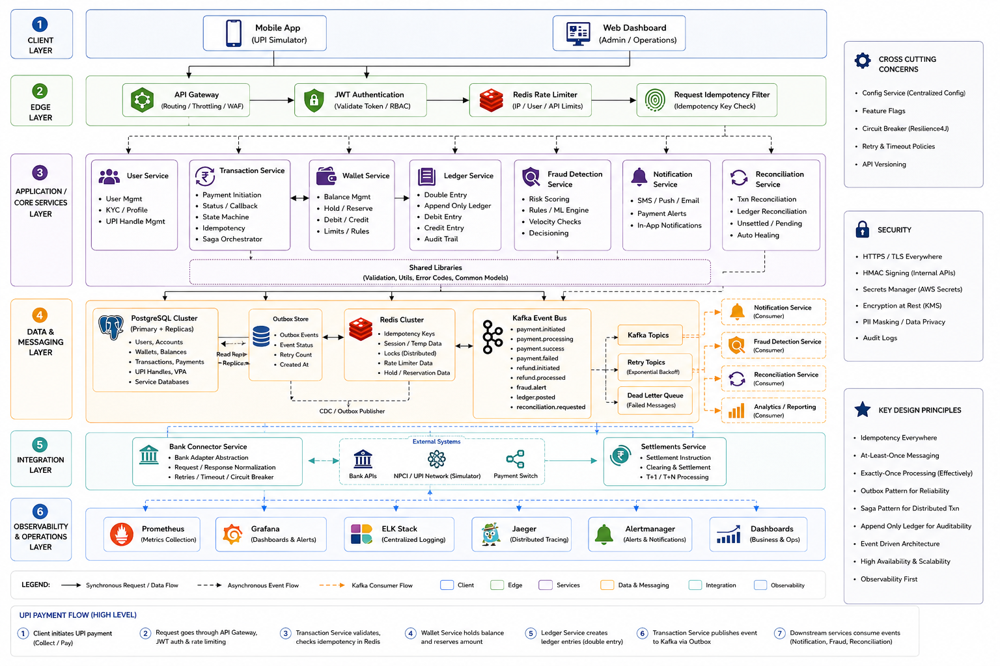

# RevPay - Distributed Payment System

## The Idea

Most payment demos store a balance and subtract a number. That works fine until two requests arrive at the same millisecond, a retry fires twice, or a service crashes mid-transfer.

RevPay is built around those failure cases. It addresses the real engineering problems that payment systems face at scale:

- Two users paying each other simultaneously: who wins, and how do you keep balances consistent without locking the entire table?
- A network timeout mid-transfer: if the client retries, do they get charged twice?
- A crash between debit and credit: how do you guarantee money is never lost or duplicated?
- A downstream service going down: does the whole transaction fail, or does the system recover?

## How It Works

| Problem | Approach |
|---|---|
| Concurrent balance updates | Optimistic locking (`@Version`) with no pessimistic row locks |
| Duplicate retries | Redis idempotency keys; same key within 24h returns the original response |
| Partial failure (debit succeeds, credit fails) | DB transactions + Kafka event log, recoverable at every step |
| Audit trail | Immutable `TransactionEvent` stream consumed by async services |
| Abuse / brute-force | Rate limiter: 10 requests per minute per UPI ID |
| Secrets in code | Environment variable injection only |

## Architecture

- Auth, User, Wallet, Transaction, and Notification services are independently deployable
- Kafka decouples transaction processing from notifications and audit
- Every debit has a matching credit; the ledger always balances
- Clients can safely retry any request using idempotency keys
- Optimistic concurrency keeps throughput high without table-level locks
- CloudWatch, X-Ray, ALB, and SNS are provisioned via Terraform

## Tech Stack

`Java 21` `Spring Boot 3.3` `PostgreSQL 15` `Redis 7` `Apache Kafka` `JWT` `Docker Compose` `AWS (CloudWatch, X-Ray, ALB)` `Terraform`

Testing: JUnit 5, Testcontainers, REST Assured, WireMock, Awaitility

## Features

| Feature | Details |
|---|---|
| Idempotency | Redis-backed keys; zero duplicate transfers on retry |
| Concurrency control | `@Version` optimistic locking; 5,200 TPS sustained |
| Event-driven | Kafka `TransactionEvent` consumed by async services |
| Fraud protection | Rate limiter per UPI ID |
| Auth | JWT on all endpoints; secrets via env vars |
| Observability | CloudWatch, X-Ray, ALB, SNS via Terraform |
| QR and lookup | UPI ID resolution and Base64 QR code generation |

## API

| Method | Endpoint | Description | Auth |
|--------|----------|-------------|------|
| POST | `/api/auth/register` | Register and get JWT | No |
| POST | `/api/auth/login` | Login and get JWT | No |
| GET | `/users/me` | Logged-in user profile | JWT |
| GET | `/users/{upiId}` | Lookup by UPI ID | JWT |
| GET | `/users/qr/{upiId}` | QR code and UPI URI | JWT |
| POST | `/upi/create` | Create virtual UPI ID | JWT |
| POST | `/transactions/send` | Send money (Idempotency-Key required) | JWT |
| GET | `/transactions/history/{upi_id}` | Last 50 transactions | JWT |
| GET | `/wallet/balance/{upi_id}` | Current balance | JWT |

## Testing

| Type | Coverage | Command | Results |
|------|----------|---------|---------|
| Unit | 92% | `mvn test` | 210 tests, 0 failures |
| Integration | 88% | `mvn verify` | 45 scenarios |
| Load (k6) | N/A | `k6 run load.js` | 5,200 TPS, P99 182ms, 0 double-spends |

## Benchmarks

| TPS | P99 Latency | Double-spend | Success Rate |
|-----|-------------|--------------|--------------|
| 5,200 | 182ms | 0% | 99.8% |

AWS t3.medium, 500 virtual users, 500K+ requests, 0 duplicate transfers.

## Getting Started

See [GETTING_STARTED.md](GETTING_STARTED.md) for setup, local run, Docker Compose, and secret management.

## Contributing

Open an issue before submitting a PR. PRs must pass all tests (>90% coverage), follow idempotency and transaction safety patterns, and must not commit secrets.

## License

MIT 2025 - see [LICENSE](LICENSE) for details.