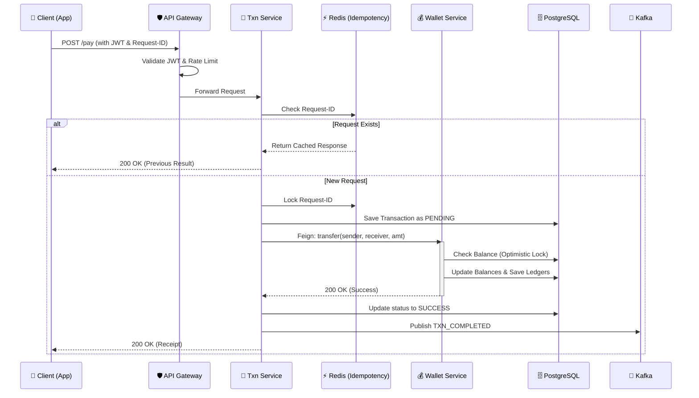

# 📐 System Architecture — Mini UPI Simulator

This document provides a detailed technical overview of the Mini UPI Simulator's architecture, data flow, and component design.

---

## 🏛️ High-Level Visual Overview

---

## 🛰️ Microservices Ecosystem

The system is composed of five core microservices, each with a specific domain responsibility:

### 1. API Gateway (Entry Point)
*   **Tech**: Spring Cloud Gateway, Redis (Reactive).
*   **Role**: Centralized entry point. It handles JWT validation and global rate limiting to prevent DDoS or brute-force attacks.
*   **Routing**: Routes `/auth/**` to User Service, `/transactions/**` to Transaction Service, etc.

### 2. User & Identity Service
*   **Tech**: Spring Boot, PostgreSQL, JJWT.
*   **Role**: Manages the "Identity" domain.
*   **Key Logic**:
    *   `UPI ID Generation`: Creates human-readable handles (e.g., `neeraj1234@miniupi`).
    *   `Auth`: Issues stateless JWT tokens upon successful PIN verification.
    *   `Events`: Publishes `UserCreatedEvent` to Kafka to trigger downstream initialization.

### 3. Wallet & Ledger Service
*   **Tech**: Spring Boot, PostgreSQL.
*   **Role**: The "Source of Truth" for money.
*   **Key Logic**:
    *   **Atomic Transfers**: Implements strict balance updates with `@Transactional`.
    *   **Optimistic Locking**: Uses JPA `@Version` to handle high-frequency concurrent balance updates without database deadlocks.
    *   **Ledgers**: Every transaction creates a double-entry ledger (Debit for sender, Credit for receiver) for auditability.

### 4. Transaction Orchestrator
*   **Tech**: Spring Boot, Redis, OpenFeign.
*   **Role**: The "Brain" of the payment flow.
*   **Key Logic**:
    *   **Idempotency Engine**: Uses Redis to cache `requestId` for 24 hours. If a client retries a request, the service returns the previous result instead of re-processing.
    *   **Fraud Engine**: Validates velocity (daily/monthly limits) and basic sanity checks (e.g., sender != receiver).

### 5. Notification Service
*   **Tech**: Spring Boot, Kafka.
*   **Role**: Asynchronous alerts.
*   **Role**: Consumes `TransactionCompletedEvent` and `TransactionFailedEvent` to send mock SMS/Email alerts to users.

---

## 🔄 Core Payment Flow (The "Happy Path")

The following sequence diagram illustrates how a single payment request is orchestrated across the system:

---

## 🛡️ Key Safety Patterns

### 1. Idempotency (Request Safety)
To prevent "Double Debits" due to network timeouts, we use a Redis-based idempotency guard. Every write request must include a `Idempotency-Key`.
*   **Check**: If key exists, return stored response.
*   **Set**: On success/failure, store result with 24h TTL.

### 2. Concurrency (Balance Safety)
We use **Optimistic Locking** instead of Pessimistic Locking to ensure high throughput. 
*   If two threads try to update the same wallet, the second one will fail with an `OptimisticLockingFailureException`.
*   The system then performs a short-delay retry or returns a "Busy" error, preserving data integrity without locking the DB row for long periods.

### 3. Event-Driven Decoupling
Notification and Audit services are **Consumer-only**. If the Notification service goes down, Kafka buffers the events, and alerts are sent once the service recovers, ensuring no alert is ever lost.

---

## 📊 Data Integration Map

| Service | Primary DB | Cache / Store | Event Role |
|---------|------------|---------------|------------|
| **User** | PostgreSQL | - | Producer (`user.created`) |
| **Wallet** | PostgreSQL | - | Consumer (`user.created`) |
| **Transaction** | PostgreSQL | Redis (Idempotency) | Producer (`txn.completed`) |
| **Notification** | - | - | Consumer (`txn.*`) |
| **Gateway** | - | Redis (Rate Limit) | - |
