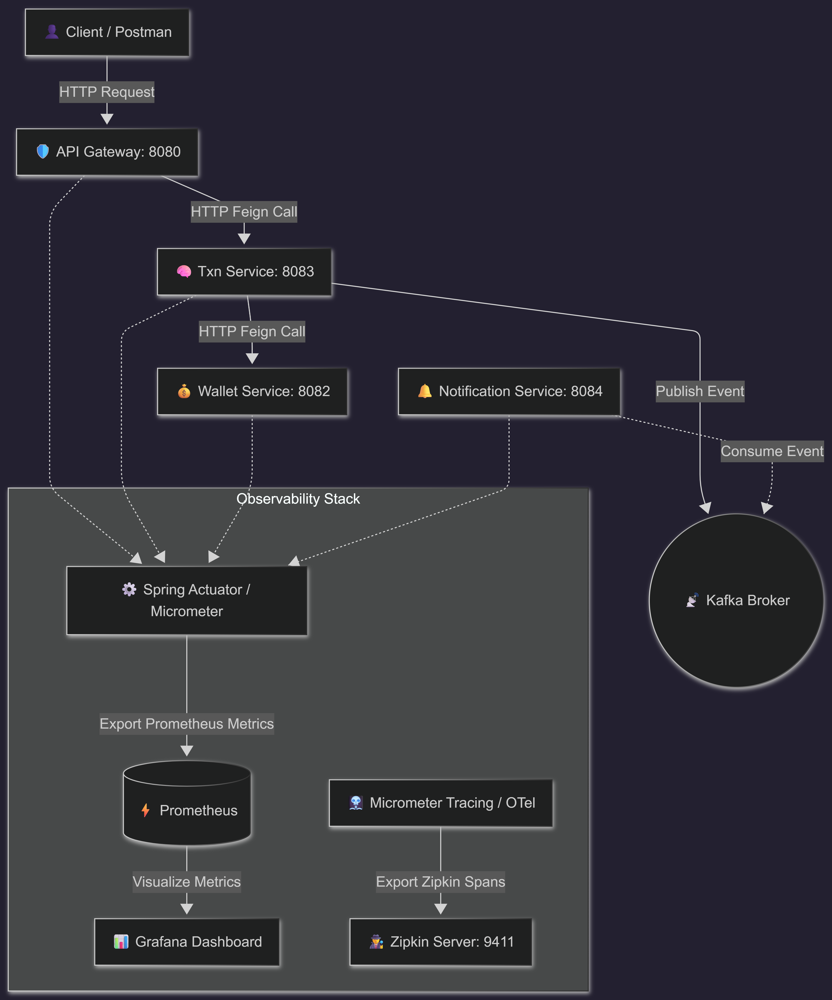

# 📊 Distributed Monitoring & Tracing Guide

This guide details how to implement full-stack **Observability (Metrics, Dashboards, and Distributed Tracing)** in the Mini-UPI microservices simulator using **Spring Boot Actuator, Micrometer, Prometheus, Grafana, OpenTelemetry (OTel), and Zipkin**.

---

## 🏗️ 1. Architecture Overview
 



Observability is divided into two primary dimensions:
1. **Monitoring (Metrics)**: Numeric measurements over time (e.g., successful/failed payments counter, latency histograms, JVM memory, CPU utilization). Done via **Micrometer + Prometheus + Grafana**.
2. **Distributed Tracing**: Tracking a single transaction's path as it travels across multiple services via network calls (HTTP/Feign) and asynchronous queues (Kafka), linked together by a unique `Trace ID` propagated in headers. Done via **Micrometer Tracing + OpenTelemetry Bridge + Zipkin**.

---

## 📦 2. Step 1: Add Dependencies to Maven Parent & Child POMs

Since the parent POM already has Spring Boot Actuator and Micrometer Prometheus included for *all* modules, we only need to declare **Tracing Dependencies**.

### Add to Parent `pom.xml` (Optional for Dependency Management) or directly to Services:
Add the following dependencies in the `<dependencies>` section of the parent `pom.xml` so they apply to all modules, or selectively inside `pom.xml` of each individual microservice:

```xml
<!-- ═══════════════ Distributed Tracing (OTel + Zipkin) ═══════════════ -->
<!-- Micrometer Tracing Core API -->
<dependency>
    <groupId>io.micrometer</groupId>
    <artifactId>micrometer-tracing</artifactId>
</dependency>

<!-- Bridge Micrometer Tracing to OpenTelemetry (OTel) -->
<dependency>
    <groupId>io.micrometer</groupId>
    <artifactId>micrometer-tracing-bridge-otel</artifactId>
</dependency>

<!-- OTel Exporter to send Spans/Traces to Zipkin -->
<dependency>
    <groupId>io.opentelemetry</groupId>
    <artifactId>opentelemetry-exporter-zipkin</artifactId>
</dependency>

<!-- Standard spring-boot-starter-actuator (already in parent pom) -->
```

*(Note: Spring Boot parent automatically imports compatible versions of the micrometer-tracing BOM, so you do not need to hardcode version tags).*

---

## ⚙️ 3. Step 2: Expose Metrics & Configure Tracing (YAML Config)

Modify the `application.yml` file of **each microservice** (Gateway, User, Wallet, Transaction, and Notification) to enable prometheus scraping and trace reporting:

```yaml
management:
  endpoints:
    web:
      exposure:
        # Expose actuator endpoints for health, info, and prometheus metrics scraping
        include: health, info, prometheus
  endpoint:
    health:
      show-details: always
  metrics:
    tags:
      # Tag all metrics with application name to filter them easily in Grafana
      application: ${spring.application.name}
    distribution:
      percentiles-histogram:
        # Generate bucket histograms for HTTP server/client latency
        http.server.requests: true
        http.client.requests: true
  
  # Distributed Tracing Configuration
  tracing:
    sampling:
      # Probability threshold. 1.0 = Sample 100% of all requests (perfect for dev/local testing)
      probability: 1.0
  zipkin:
    tracing:
      # Endpoint URL of your Zipkin server
      endpoint: http://localhost:9411/api/v2/spans
```

---

## 🐳 4. Step 3: Spin Up Zipkin in `docker-compose.yml`

A Zipkin server container is already configured and ready to run inside your root `docker-compose.yml`. 

To spin up all infrastructure (PostgreSQL, Redis, Kafka, Prometheus, Grafana, and Zipkin), execute:
```bash
docker-compose up -d
```
* **Zipkin Web Dashboard**: Access at `http://localhost:9411`
* **Prometheus Dashboard**: Access at `http://localhost:9090`
* **Grafana Dashboard**: Access at `http://localhost:3000` (Default password: `admin`)

---

## 📈 5. Step 4: Implement Custom Business Metrics

To measure specific payment metrics (e.g. TPS, payment failures, transaction values), register custom counters and timers inside your business services using Micrometer's `MeterRegistry`.

### Example inside `TransactionService.java`:
```java
package com.neeraj.upi.transaction.service;

import io.micrometer.core.instrument.Counter;
import io.micrometer.core.instrument.MeterRegistry;
import io.micrometer.core.instrument.Timer;
import org.springframework.stereotype.Service;
import java.math.BigDecimal;

@Service
public class TransactionService {

    private final Counter paymentSuccessCounter;
    private final Counter paymentFailureCounter;
    private final Timer paymentTimer;

    // Inject MeterRegistry
    public TransactionService(MeterRegistry registry) {
        this.paymentSuccessCounter = Counter.builder("upi.payments.count")
                .tag("status", "SUCCESS")
                .description("Number of successful payments processed")
                .register(registry);

        this.paymentFailureCounter = Counter.builder("upi.payments.count")
                .tag("status", "FAILED")
                .description("Number of failed payments")
                .register(registry);

        this.paymentTimer = Timer.builder("upi.payments.latency")
                .description("Time taken to process end-to-end payment transaction")
                .publishPercentiles(0.5, 0.95, 0.99)
                .register(registry);
    }

    public PayResponse pay(PayRequest request, String senderUpiId) {
        // Record latency end-to-end
        return paymentTimer.record(() -> {
            try {
                // ... core payment logic (Idempotency -> Fraud -> Feign -> Commit) ...
                
                paymentSuccessCounter.increment();
                return response;
            } catch (Exception ex) {
                paymentFailureCounter.increment();
                throw ex;
            }
        });
    }
}
```

---

## ⛓️ 6. Step 5: Distributed Trace ID Propagation (Automatic!)

The magic of **Micrometer Tracing** (with Spring Cloud Gateway, OpenFeign, and Kafka) is that it performs **automatic context propagation** across thread and network boundaries:

### 1. HTTP / Feign Call Propagation
When the Gateway forwards a request to `transaction-service`, and the transaction-service calls `wallet-service` via OpenFeign, OpenFeign automatically intercepts the outgoing HTTP call and injects a standard W3C tracing header:
```http
traceparent: 00-4bf92f3577b34da6a3ce929d0e0e4736-00f067aa0ba902b7-01
```
*(Format: `00-{TraceID}-{ParentSpanID}-{TraceFlags}`)*

Both downstream services read this header, join the active trace, and create a "child span", letting you see the full timeline across the network!

### 2. Kafka Message Headers Propagation
When `transaction-service` logs an outbox event and the `OutboxScheduler` publishes a `TransactionCompletedEvent` to Kafka, the `KafkaTemplate` automatically injects the active Trace ID into the Kafka Record Metadata headers:
```
Header: traceparent = 00-4bf92f3577b34da6a3ce929d0e0e4736-00f067aa0ba902b7-01
```
When `notification-service` consumes this message, it extracts the trace details from the message headers, so your asynchronous SMS logs share the **exact same Trace ID** as the original REST client request!

---

## 👁️ 7. Step 6: Verify and Visualize

1. Start all infrastructure containers: `docker-compose up -d`
2. Start all microservices on their respective ports.
3. Make a payment API call via API Gateway (`POST http://localhost:8080/api/v1/payments/initiate`).
4. **View Distributed Traces (Zipkin)**:
   * Go to `http://localhost:9411`
   * Click **"Run Query"** to see your recent trace list.
   * Click on a trace to see a visual timeline spanning multiple servers:
     ```
     [api-gateway]       ██████████████████████████████████████████ 150ms
       [transaction-svc]     ██████████████████████████████████ 120ms
         [wallet-svc]             ███████████████████████ 60ms
       [notification-svc]                       █████████ 20ms (Async via Kafka)
     ```
5. **View Metrics (Grafana)**:
   * Go to `http://localhost:3000`
   * Under datasources, configure Prometheus (`http://prometheus:9090` or `http://host.docker.internal:9090`).
   * Import standard Spring Boot dashboards (e.g. Dashboard ID **4701** or **11378**) or visualize your custom metrics like `upi_payments_count_total`.
