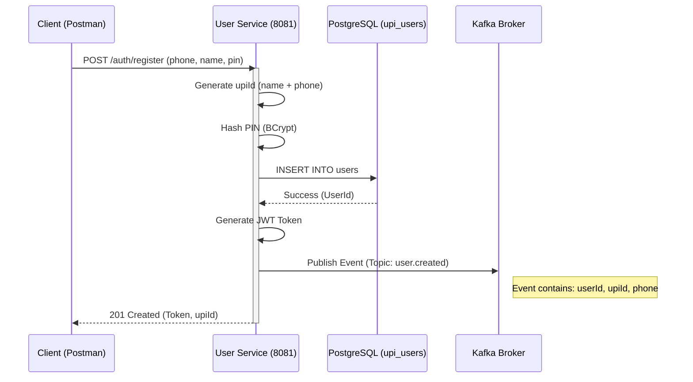

# Phase 1: User Service & Identity Flow

The **User Service** is the starting point of the Mini UPI simulator. It manages identity, handles JWT generation, and ensures new users get set up properly across the system by emitting Kafka events.

## 📌 Architecture Flow

1. **Client** calls `/auth/register` with `fullName`, `phone`, and `pin`.
2. **User Service** generates a unique `upiId` (e.g., `neeraj1234@miniupi`).
3. It securely hashes the `pin` using BCrypt and saves the user to the `upi_users` database.
4. It generates a stateless **JWT token** using `jjwt`.
5. It publishes an asynchronous `user.created` event to the **Kafka broker**.

## 📊 Sequence Diagram: User Registration

## 🔑 Security Filter (`JwtAuthFilter`)

All secure endpoints (like `/users/me`) require the client to pass the JWT in the `Authorization` header:
`Authorization: Bearer <your.jwt.token>`

The filter intercepts the request, verifies the signature using the `jwt.secret`, extracts the `userId`, and sets it in the Spring `SecurityContext`.
