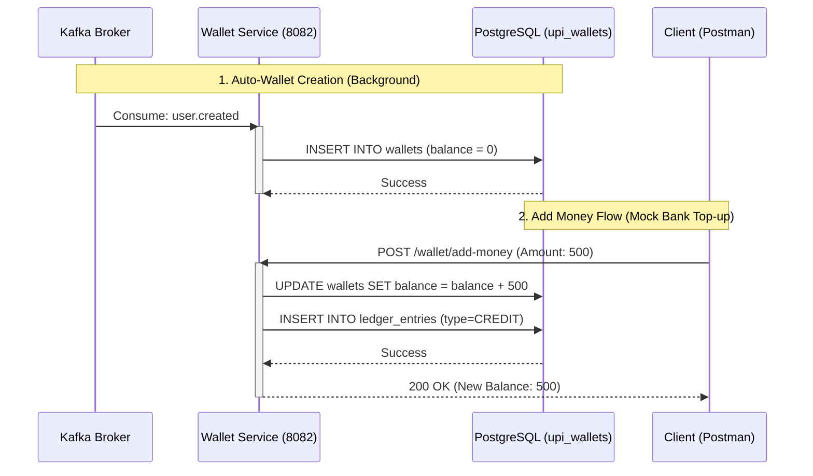

# Phase 2: Wallet Service & Ledgers

The **Wallet Service** is responsible for all money math. It does not handle passwords or JWT generation; it strictly manages account balances and maintains an immutable ledger of all transactions.

## 📌 Core Flows

### 1. Auto-Wallet Creation (Asynchronous)
When a user registers in Phase 1, the Wallet Service automatically creates a wallet for them.
*   **KafkaListener:** Listens to `user.created`.
*   **Action:** Inserts a new row in `upi_wallets` with `balance = 0.00`.

### 2. Atomic Transfers (Synchronous / Internal)
When money moves, it must be atomic (either both debit and credit succeed, or neither do).
*   The method is annotated with `@Transactional`.
*   If the sender's balance drops below ₹0, an `InsufficientFundsException` is thrown, instantly rolling back the entire database transaction.

## 📊 Sequence Diagram: Wallet Auto-Creation & Adding Money

