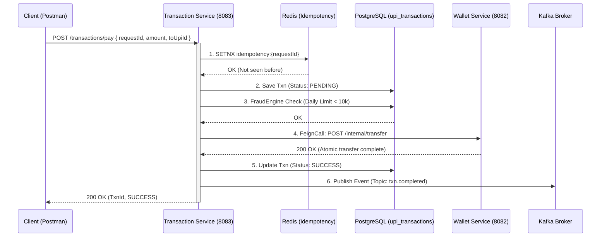

# Phase 3: Transaction Orchestration & Idempotency

The **Transaction Service** is the brain of the payment operation. It coordinates the payment by verifying rules (fraud limits) and delegating the actual money movement to the Wallet Service via internal REST calls (OpenFeign).

## 📌 Key Architectural Concepts

### 1. Idempotency (Redis)
To prevent network retries from double-charging a user, the client sends a unique `requestId` (UUID). 
The service uses Redis `SETNX` (Set if Not Exists). If the key already exists, the service halts processing and returns the cached result.

### 2. Velocity / Fraud Checks
The service queries the database to see how much money the sender has transferred successfully today. If `Today's Transferred Amount + Current Request > ₹10,000`, the transaction is blocked.

## 📊 Sequence Diagram: The 6-Step Payment Flow

