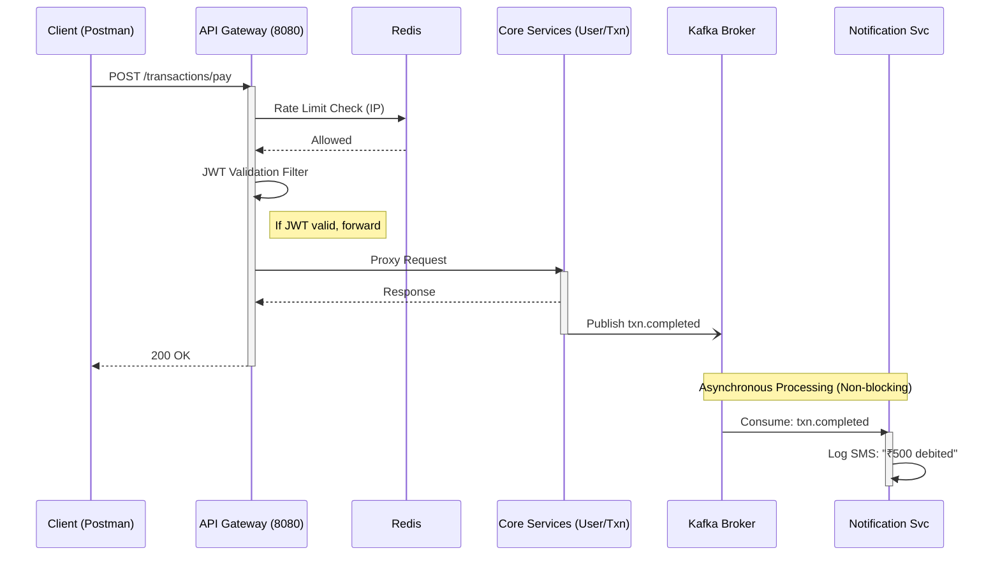

# Phase 4: API Gateway & Notification Service

The final phase introduces the **API Gateway** (the unified perimeter) and the **Notification Service** (the background worker).

## 📌 Components

### 1. Spring Cloud Gateway (`api-gateway`)
All external traffic hits Port `8080`.
*   **Routing:** `/auth/**` goes to user-service. `/transactions/**` goes to transaction-service.
*   **Reactive JWT Filter:** Before forwarding the request, the gateway runs reactive logic to check the JWT token.
*   **Redis Rate Limiting:** A `RequestRateLimiter` restricts the client IP to a specific number of requests per minute (Token Bucket Algorithm).

### 2. Notification Service (`notification-service`)
This service is completely decoupled. It listens to the Kafka topics (`user.created` and `txn.completed`) and acts upon them. If this service goes down, the core payment flow is NOT affected (Eventual Consistency).

## 📊 Sequence Diagram: Global Architecture Flow

